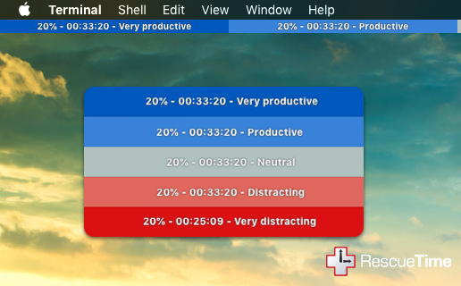
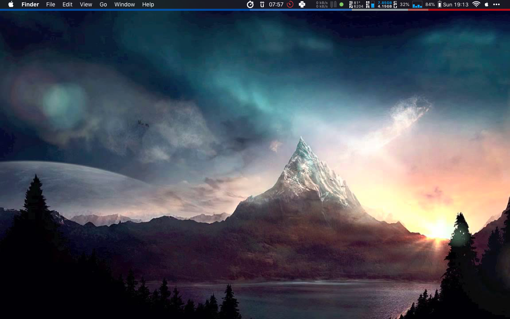

# Rescuetime Bar for [Übersicht](http://tracesof.net/uebersicht/)

Rescuetime bar allow you to visualize your daily productivity data




## Getting Started
You will need an access token for the widget to be able to access the Rescuetime API.
This can be obtained at [https://www.rescuetime.com/anapi/manage](https://www.rescuetime.com/anapi/manage)

paste your key in the lib/config.json file 

``` config.json
{
    "params": {
        "key": "YOUR RESCUETIME API KEY!"
    }
}
```


